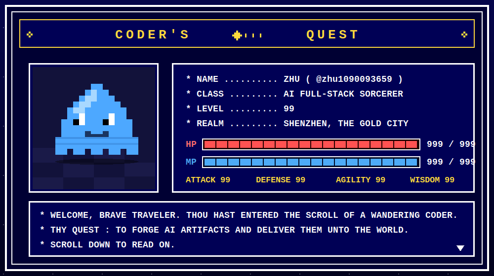
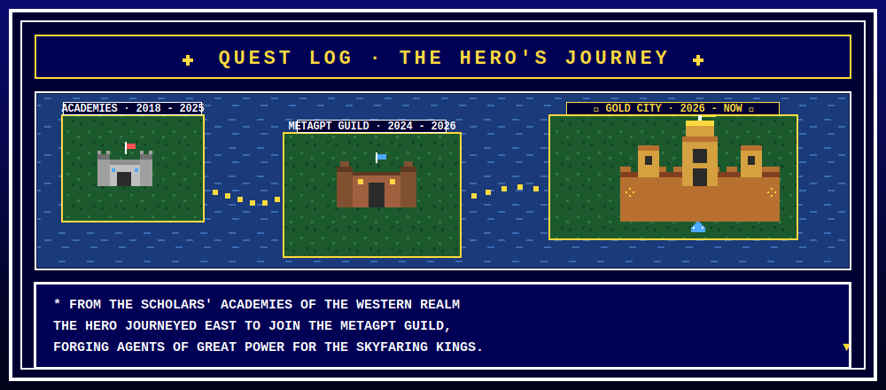
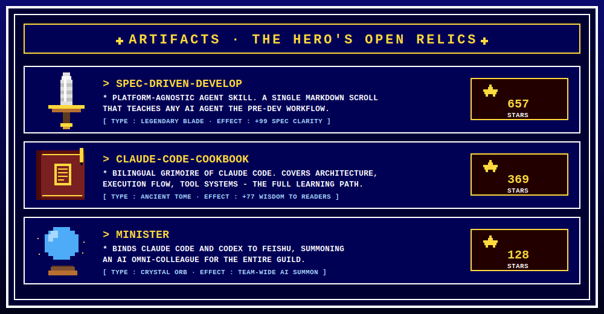
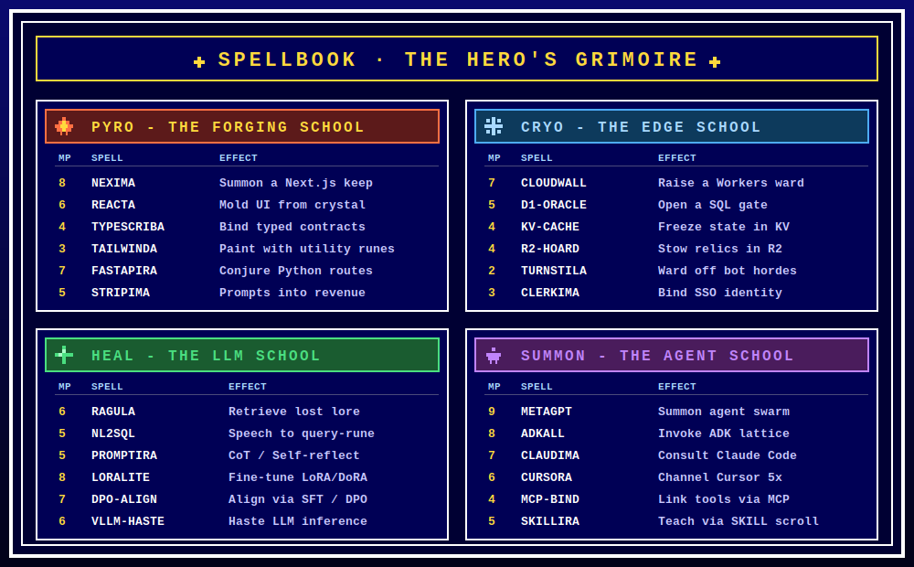

<div align="center">

<!-- ═══════════════════════════════════════════════════════ -->
<!--         ▼  COPY THIS REPO TO  zhu1090093659/zhu1090093659         -->
<!--         ▼  PLACE SVGs UNDER  ./assets/                            -->
<!-- ═══════════════════════════════════════════════════════ -->



&nbsp;

### ★  ★  ★   P R E S S   S T A R T   ★  ★  ★

</div>

---

<div align="center">

## ◆ &nbsp; CHAPTER  I &nbsp; · &nbsp; THE  HERO'S  JOURNEY &nbsp; ◆



</div>

```
┌───────────────────────────────────────────────────────────────┐
│  * LONG AGO, THE HERO STUDIED THE ANCIENT ARTS OF COMPUTATION │
│    IN THE SCHOLARS' ACADEMIES OF THE WESTERN REALM.           │
│                                                               │
│  * UPON COMPLETING HIS MASTERY, HE VENTURED EAST TO JOIN      │
│    THE METAGPT GUILD -- A COMPANY OF MULTI-AGENT ARCHITECTS   │
│    WHOSE NAMES ARE WHISPERED WHEREVER DEVELOPERS GATHER.      │
│                                                               │
│  * THERE HE FORGED AN AGENT ORACLE FOR THE SKYFARING KINGS,   │
│    A MODELCRAFT PLATFORM THAT READS THE WINDS OF FLIGHT       │
│    DATA AND DIVINES FAILURES BEFORE THEY STRIKE.              │
│                                                               │
│  * NOW THE HERO DWELLS IN SHENZHEN, THE GOLD CITY, WHERE      │
│    FORTUNE IS FORGED FROM CODE AND THE QUEST CONTINUES...     │
└───────────────────────────────────────────────────────────────┘
```

---

<div align="center">

## ◆ &nbsp; CHAPTER  II &nbsp; · &nbsp; THE  CURRENT  QUEST &nbsp; ◆

</div>

```
╔═══════════════════════════════════════════════════════════════╗
║  ▼ ACTIVE QUEST                                               ║
║                                                               ║
║    QUEST NAME  ..  GENTRACK.AI                                ║
║    CLASS       ..  SOLO FULL-STACK EXPEDITION                 ║
║    OBJECTIVE   ..  TRACK A BRAND'S VISIBILITY WITHIN THE      ║
║                    FOUR GREAT AI ORACLES OF LEGEND --         ║
║                    CHATGPT, PERPLEXITY, CLAUDE, GEMINI.       ║
║                                                               ║
║    STACK       ..  NEXT.JS  +  CLOUDFLARE WORKERS             ║
║                    CLERK AUTH  +  STRIPE BILLING              ║
║                    D1 / KV / R2   [ FULL SERVERLESS ]         ║
║                                                               ║
║    STATUS      ..  >>  ONGOING  <<                            ║
╚═══════════════════════════════════════════════════════════════╝
```

> &nbsp;&nbsp; * &nbsp; FROM PRODUCT DESIGN TO AUTH, PAYMENT, PROMPT ANALYSIS,
> COMPETITIVE INTELLIGENCE AND BOT DEFENSE &mdash; EVERY STONE OF THIS FORTRESS
> WAS LAID BY A SINGLE PAIR OF HANDS.

---

<div align="center">

## ◆ &nbsp; CHAPTER  III &nbsp; · &nbsp; OPEN  RELICS &nbsp; ◆



</div>

```
┌───────────────────────────────────────────────────────────────┐
│  * 1,150+ STARS EARNED ACROSS THE GITHUB REALM                │
│  * SCROLLS WRITTEN IN BOTH ENGLISH AND CHINESE TONGUES        │
│  * FORKED AND WIELDED BY DEVELOPERS ACROSS EVERY CONTINENT    │
└───────────────────────────────────────────────────────────────┘
```

---

<div align="center">

## ◆ &nbsp; CHAPTER  IV &nbsp; · &nbsp; THE  SPELLBOOK &nbsp; ◆



</div>

> &nbsp;&nbsp; * &nbsp; FOUR SCHOOLS. &nbsp; FOUR-AND-TWENTY SPELLS. &nbsp; ONE HERO.

---

<div align="center">

## ◆ &nbsp; CHAPTER  V &nbsp; · &nbsp; PARTY  STATUS &nbsp; ◆

&nbsp;

<a href="https://github.com/zhu1090093659">
  
</a>
<a href="https://git.io/streak-stats">
  
</a>

<a href="https://github.com/zhu1090093659">
  
</a>

</div>

---

<div align="center">

## ◆ &nbsp; CHAPTER  VI &nbsp; · &nbsp; SUMMON  THE  HERO &nbsp; ◆

</div>

```
╔═══════════════════════════════════════════════════════════════╗
║  * COMMAND?                                                   ║
║                                                               ║
║    >  TALK     .....  Open an issue upon any relic above      ║
║    >  TRADE    .....  Fork a scroll, send a pull request      ║
║    >  STATUS   .....  Thou art reading it now                 ║
║    >  SPELL    .....  Ask, and the spellbook shall answer     ║
║                                                               ║
║  * LET  THE  QUEST  CONTINUE...                               ║
╚═══════════════════════════════════════════════════════════════╝
```

---

<div align="center">

```

           *  THE  HERO'S  QUEST  IS  NEVER  TRULY  FINISHED.  *

                  THANK  YOU  FOR  READING  THIS  SCROLL.   ▼

```

&nbsp;


</div>
